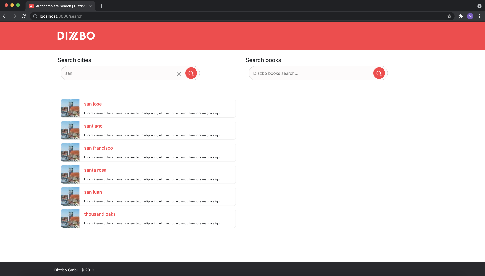

# Dizzbo Autocomplete Search

This project was bootstrapped with [Create React App](https://github.com/facebook/create-react-app).
    

- [Goal](#goal)
- [User Stories](#user-stories)
- [Scenario](#scenario)
- [Available Scripts](#available-scripts)
- [Docker Setup](#docker-setup)
- [Screenshots](#screenshots)

<a name="#goal"></a>

## Goal

The production-ready application module developed to search for cities and books along with autocomplete suggestions.

Solution containing:

- implemented [user stories](#user-stories)
- work accordingly to provided [scenarios](#scenario)

<a name="#user-stories"></a>

## User stories

- autocomplete search field for cities and books
- top level api using `createContext` in order to store searchTerm and query results
- display messages to the user while searching for cities or books such as "at least 3 characters are required" and "data not found"
- auto suggestions integrated as Google have
- tried to make a user experience a bit friendly

<a name="#scenario"></a>

## Scenario

1. Open `localhost:8080`
2. Load search field for cities
3. Enter at least three characters to load cities
4. Click on search icon or press keyboard Enter button takes you to another screen
5. Display cities and books search field, and also load all the cities over the page based on the search criteria
6. Search for books and render book title and author along with a dummy image and description

<a href="#available-scripts"></a>

## Available Scripts

In the project directory, you can run the below commands to run, build and test the application.

### `yarn start`

In order to run the app locally (in the development mode), you can just type yarn start in the terminal and press Enter, and the command will open the application automatically in your default browser.

The app will open in the browser at http://localhost:3000.

If you make any changes in the code, the webpage will automatically update the changes without refreshing the page manually. Also, lint errors can be seen in the console.

<a href="#docker-setup"></a>

## Docker Setup

<hr />

You can also run the application in the docker container.

### Prerequisites

Please make sure you already installed Docker Engine (if using mac or windows especially).

In case, docker is not installed then you could refer to this link https://docs.docker.com/docker-for-mac/install/ (for mac users)

Using docker will allow you to run the application without installing Node/Npm or Nginx server or downgrading/upgrading the Node version, because all dependencies will exist inside the docker images.

```html
$ docker -v
Docker version 20.10.6, build 370c289
```

### Repository Cloning

Once docker is installed on your local machine, you can start cloning the repository by using HTTPS or SSH

```html
git clone https://github.com/Adeel91/dizzbo-autosearch.git
cd dizzbo-autosearch
```

### Build and Run Docker Image

Now, you are ready to build the application on docker, and run the docker image at 8080 port.

```html
docker build -t dizzbo-autosearch .
docker run -d -p 8080:8080 dizzbo-autosearch
```

Open up the browser and enter this URL: http://localhost:8080

<a name="#screenshots"></a>

## Screenshots

The screenshots of the application are as follows:

<table>
  <tr>
    <td>  </td>
    <td>  </td>
  </tr>
  <tr>
    <td>  </td>
    <td>  </td>
  </tr>
  <tr>
    <td>  </td>
    <td>  </td>
  </tr>
</table>
